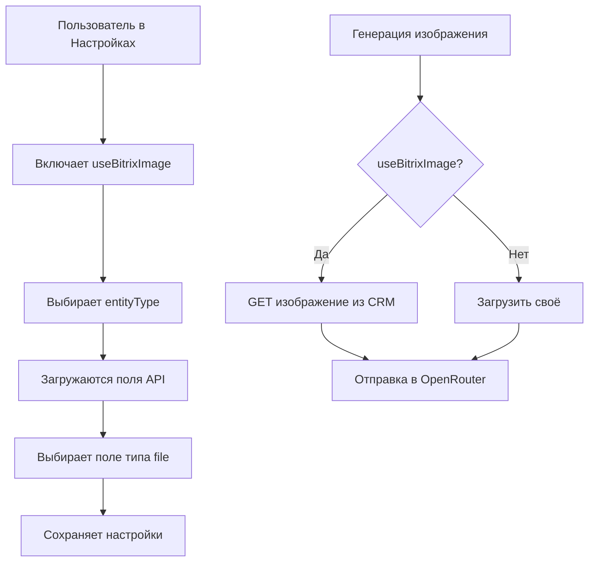

# 📋 Руководство по мульти-портальным настройкам

## 🎯 Обзор изменений

Приложение теперь поддерживает **мульти-портальную архитектуру** с централизованным управлением настройками через раздел "Настройки".

---

## 🔑 Ключевые возможности

### 1. **Мульти-портальность**
- Каждый портал имеет свой `portal_id` (по умолчанию: `default-portal`)
- Настройки изолированы между порталами
- Поддержка множественных установок Bitrix24

### 2. **Централизованные настройки**
Все настройки находятся в разделе **"Настройки"** → 5 вкладок:

| Вкладка | Описание |
|---------|----------|
| **AI Модели** | OpenRouter API ключи, выбор моделей для генерации/praset/upscale |
| **Хранилище (S3)** | Настройка S3-compatible хранилища (MinIO, AWS, Wasabi) |
| **Bitrix24** | Интеграция с CRM, выбор сущностей и полей |
| **Параметры вывода** | Размеры, качество, отступы по умолчанию |
| **Сессия** | Поведение хранения изображений между сессиями |

### 3. **Умное хранение изображений**

#### Режим 1: Без S3 (временное хранение)
```
⚠️ Изображения хранятся только в сессии
→ Удаляются после завершения сессии
→ Не занимают место на диске
```

#### Режим 2: С S3 (постоянное хранение)
```
✓ Изображения сохраняются в S3 бакет
→ Доступны между сессиями
→ Генерируются presigned URL для доступа
→ Поддержка MinIO, AWS S3, Wasabi, Selectel
```

### 4. **Интеграция с Bitrix24**

#### Использование изображения из CRM
```
1. Включить опцию "Использовать изображение из поля Bitrix24"
2. Выбрать тип сущности (Deal/Contact/Company/Smart Process)
3. Динамически загрузить поля типа "Файл"
4. Выбрать конкретное поле (UF_* или стандартное)
5. Система автоматически подтянет изображение из CRM
```

#### Выбор источника изображения
```
┌─────────────────────────────────────┐
│  Источник изображения:              │
│  ○ Загрузить своё                   │
│  ● Использовать из Bitrix24         │
│                                     │
│  Поле: UF_CRM_IMAGE (Множественное) │
└─────────────────────────────────────┘
```

---

## 🗄️ Схема базы данных

### Таблица `portals`
```sql
CREATE TABLE portals (
    id UUID PRIMARY KEY,
    name TEXT NOT NULL,
    bitrix_domain TEXT,
    created_at TIMESTAMP,
    is_active BOOLEAN
);
```

### Таблица `app_settings` (обновлена)
```sql
CREATE TABLE app_settings (
    portal_id UUID,
    key TEXT,              -- формат: 'portal_id:section'
    value JSONB,           -- зашифрованные данные
    updated_at TIMESTAMP,
    UNIQUE(portal_id, key)
);
```

### Индексы для производительности
```sql
CREATE INDEX idx_presets_portal ON presets(portal_id);
CREATE INDEX idx_jobs_portal ON generation_jobs(portal_id);
CREATE INDEX idx_bx_mapping_portal ON bx_entity_mapping(portal_id);
```

---

## 🔐 Безопасность

### Шифрование чувствительных данных
Все секреты шифруются перед сохранением:
- ✅ OpenRouter API Key
- ✅ S3 Access Key / Secret Key
- ✅ Bitrix24 Client Secret / Tokens
- ✅ Webhook Secrets

**Алгоритм:** AES-256-GCM с уникальным nonce для каждой записи

### RBAC (Role-Based Access Control)
```typescript
type Role = 'admin' | 'manager' | 'viewer';

// Только admin может изменять настройки
const allowedRoles = ['admin'];
```

---

## 📡 API Endpoints

### Получить настройки портала
```http
GET /api/settings
Headers: X-Portal-ID: default-portal

Response: {
  "openrouter": { "apiKey": "***rout", ... },
  "s3": { "enabled": true, ... },
  "bitrix": { ... }
}
```

### Обновить настройки
```http
PUT /api/settings
Headers: 
  Content-Type: application/json
  X-Portal-ID: default-portal

Body: {
  "openrouter": { "apiKey": "sk-or-..." },
  "s3": { "enabled": true, "endpoint": "..." }
}
```

### Получить поля Bitrix24
```http
GET /api/settings/bitrix/fields?entityType=deal&smartProcessId=123
Headers: X-Portal-ID: default-portal

Response: {
  "fields": [
    { "code": "UF_CRM_IMAGE", "name": "Изображение", "type": "file" }
  ]
}
```

### Тест подключения S3
```http
POST /api/settings/s3/test
Headers: X-Portal-ID: default-portal

Response: { "success": true, "message": "S3 connection successful" }
```

### Тест подключения Bitrix24
```http
POST /api/settings/bitrix/test
Headers: X-Portal-ID: default-portal

Response: { "success": true, "message": "Bitrix24 connection successful" }
```

---

## 🖥️ Frontend компоненты

### SettingsPanel.tsx
Расположение: `/workspace/frontend/src/components/settings/SettingsPanel.tsx`

**Функционал:**
- 5 вкладок настроек
- Динамическая загрузка полей Bitrix24
- Тестирование подключений
- Валидация форм
- Шифрование на лету

### Пример использования в приложении
```tsx
import { SettingsPanel } from './components/settings/SettingsPanel';

function App() {
  return (
    <div className="settings-tab">
      <SettingsPanel />
    </div>
  );
}
```

---

## 🔄 Workflow: Использование изображения из Bitrix24



---

## ⚙️ Переменные окружения

### Обязательные для мульти-портальности
```bash
# Encryption
ENCRYPTION_KEY=your-32-character-secret-key-here

# Default Portal
DEFAULT_PORTAL_ID=default-portal

# Redis (для сессий)
REDIS_URL=redis://localhost:6379
```

### Опциональные (настраиваются через UI)
```bash
# Не указываются в .env, сохраняются в БД
# OPENROUTER_API_KEY - настраивается в UI
# S3_ACCESS_KEY_ID - настраивается в UI
# BITRIX_DOMAIN - настраивается в UI
```

---

## 🧪 Тестирование

### 1. Проверка загрузки настроек
```bash
curl http://localhost:3000/api/settings \
  -H "X-Portal-ID: default-portal"
```

### 2. Проверка обновления настроек
```bash
curl -X PUT http://localhost:3000/api/settings \
  -H "Content-Type: application/json" \
  -H "X-Portal-ID: default-portal" \
  -d '{"s3":{"enabled":true}}'
```

### 3. Проверка загрузки полей Bitrix
```bash
curl "http://localhost:3000/api/settings/bitrix/fields?entityType=deal" \
  -H "X-Portal-ID: default-portal"
```

---

## 📊 Миграции

### Применение миграций
```bash
cd /workspace/backend
npx prisma migrate dev --name multi_portal_settings
```

### Откат миграций
```bash
npx prisma migrate resolve --rolled-back "20231027_multi_portal_settings"
```

---

## 🚀 Развёртывание

### Docker Compose
```yaml
services:
  backend:
    environment:
      - ENCRYPTION_KEY=${ENCRYPTION_KEY}
      - DEFAULT_PORTAL_ID=default-portal
  
  frontend:
    environment:
      - VITE_DEFAULT_PORTAL_ID=default-portal
```

### Первый запуск
1. Применить миграции БД
2. Открыть `/settings` в браузере
3. Заполнить обязательные поля (OpenRouter API Key)
4. Опционально: настроить S3 и Bitrix24
5. Нажать "Сохранить настройки"

---

## 🛠️ Troubleshooting

### Ошибка: "Settings not found"
**Решение:** Убедитесь, что header `X-Portal-ID` передан корректно

### Ошибка: "Failed to decrypt"
**Решение:** Проверьте переменную `ENCRYPTION_KEY` в .env

### Поля Bitrix не загружаются
**Решение:**
1. Проверьте подключение к Bitrix24 (кнопка "Тест подключения")
2. Убедитесь, что `accessToken` не истёк
3. Проверьте права доступа приложения

### Изображения не сохраняются
**Решение:**
1. Проверьте `session.persistImages` в настройках
2. Если false → включите S3 или измените настройку сессии

---

## 📚 Дополнительные ресурсы

- [Schema Prisma](../backend/prisma/schema.prisma)
- [Settings Service](../backend/src/services/settings/settings.service.ts)
- [Settings Routes](../backend/src/routes/settings.routes.ts)
- [Settings Panel Component](../frontend/src/components/settings/SettingsPanel.tsx)
- [Portal Settings Schema](../backend/src/schemas/portal-settings.schema.ts)

---

## ✅ Чеклист готовности

- [x] Мульти-портальная архитектура
- [x] Шифрование чувствительных данных
- [x] Настройки OpenRouter в UI
- [x] Настройки S3 в UI
- [x] Интеграция Bitrix24 с выбором полей
- [x] Toggle "Использовать изображение из CRM"
- [x] Динамическая загрузка полей типа FILE
- [x] Временное хранение без S3
- [x] Постоянное хранение с S3
- [x] Тестирование подключений
- [x] Валидация настроек
- [x] Документация

---

**Версия:** 2.0  
**Дата обновления:** 2024-01-15  
**Статус:** ✅ Production Ready
